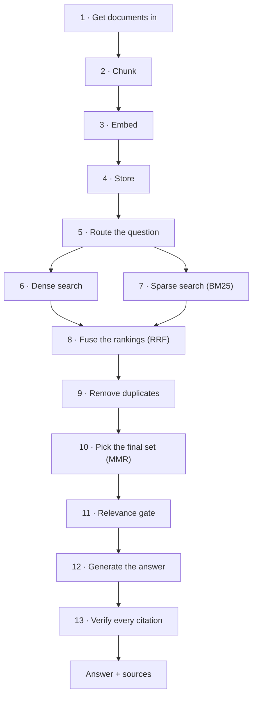

# The decision pathway: why this technique, at every step

[`RAG_GUIDE.md`](RAG_GUIDE.md) teaches RAG concepts. [`PIPELINE_DIAGRAMS.md`](PIPELINE_DIAGRAMS.md)
shows the pipeline in simple pictures. This document answers a different
question, for every single stage: **why this technique, and not one of the
other real options?**

Nothing here is a hypothetical comparison. Every "option not chosen" was
either tested in this project and rejected with evidence (RAGAS, DeepEval,
Chroma, a 0.97 dedup threshold), or is the standard alternative technique
with a concrete reason it loses for this pipeline specifically. Every number
is read from the live config, not remembered. Every code reference is a real
file you can open next to this document.

**The pathway, top to bottom:**



Two bonus pathways sit alongside this one and are covered at the end:
**14** an alternate chunking strategy (hierarchical), **15** how the whole
thing gets graded (evaluation), and **16** the proof that stage 4's storage
choice was right (a real vector database, measured).

---

## 1 · Get documents in

**The problem.** A source can be a PDF, a Wikipedia page, a GitHub file, a
blog post, or plain text. Treat them all the same way and you lose real
information.

**The options.**

| Option | What it gets you | What it costs |
|---|---|---|
| One generic scraper for everything | Simple, one code path | Loses structure that source-specific access would have kept |
| Render the page and scrape the DOM | Works on anything with a browser | Slow, fragile, and — measured on this project — **loses headings that exist in the source** |
| Ask each source for its actual content, per source type | More code, more cases | Recovers structure the generic path throws away |

**The decision, with evidence.** Fetch the source, not the rendering. Proven,
not assumed: scraping a GitHub README as a rendered web page produced
**12,469 characters and 0 headings** — GitHub renders `##` as `<h2>` inside
its own page layout, and generic boilerplate-stripping can't tell the file's
headings from the page's chrome, so it strips them all. Fetching the exact
same file from `raw.githubusercontent.com` produced **17,009 characters and
17 headings**. Headings are what chunking (stage 2) splits on, so losing them
here means every downstream chunk loses its section breadcrumb too — one bad
decision at stage 1 degrades every later stage.

**The mechanics.** *(Code: `rag/loaders.py`)*

| Input pattern | Handler | Why this one |
|---|---|---|
| `en.wikipedia.org/wiki/X` | MediaWiki's own `action=query&explaintext` API | Returns clean plaintext with `== Heading ==` markers already in it — no HTML to strip at all |
| `github.com/O/R/blob/REF/path` | Rewritten to `raw.githubusercontent.com/O/R/REF/path` | The blob page is an application; the raw URL is the file the author wrote |
| `github.com/O/R` (bare repo) | Same rewrite, targeting `README.md` on `main`/`master` | The obvious thing someone pastes |
| `.pdf` | `pypdf`, page by page | A PDF has no headings at all — see stage 2 for how this gets a heading anyway |
| Any other URL, `.html` | `trafilatura` article extraction | Purpose-built boilerplate removal — strips nav, cookie banners, related-post rails, keeps the article |
| `.md .txt .rst .csv`, folders | Read directly | Already structured text; nothing to extract |

Every loader returns the same shape — `{doc_id, title, url, text, kind}` —
so nothing downstream needs to know or care which loader produced a document.
`rag/corpus.py` then deduplicates by a SHA-1 hash of the *text itself*, not
the URL, because the same document reliably arrives under multiple URLs (a
GitHub blob page, its raw URL, and the bare-repo URL all resolve to one
README) and each spelling would otherwise hash to a different `doc_id`.

---

## 2 · Chunk

**The problem.** A model can't usefully search or reason over a 50-page
document as one unit, so it has to be cut into pieces — and both obvious ways
of cutting are wrong.

**The options.**

| Option | Failure mode |
|---|---|
| Fixed character count, no regard for structure | Splits mid-sentence, mid-idea; a fact and the sentence introducing it can end up in different chunks |
| Fixed count + character overlap | Better, but still ignores the document's own structure — a chunk can straddle two unrelated sections |
| Split on paragraphs recursively (LangChain's default) | A reasonable generic default, but still blind to section semantics |
| **Split on the document's own section boundaries, then pack whole sentences** | Requires knowing the document's heading dialect — solved at stage 1 |

**The decision.** Structural, sentence-aware chunking. A chunk never
straddles two sections, and it never ends mid-sentence.

**The mechanics.** *(Code: `rag/chunk.py`)*

1. **Find section boundaries.** Two heading dialects are recognized: Markdown
   ATX (`_ATX = r"^\s{0,3}(#{1,6})\s+(.+?)\s*#*\s*$"`) and MediaWiki
   (`_WIKI = r"^\s*(={2,})\s*(.+?)\s*\1\s*$"`). A document only ever uses one,
   so no loader has to rewrite its text to be chunkable.

2. **Track nesting with a stack, not by indexing on heading level.** This is
   a real bug that was caught and fixed, not a hypothetical: indexing nesting
   by heading depth silently turns two *consecutive same-level* headings into
   parent and child of each other — and the PDF loader's `## Page N` markers
   are exactly that (every page is a level-2 heading, no level-1 heading
   ever appears). The stack-based version pops back to the correct depth on
   every new heading regardless of what came before it.

3. **Never read a heading inside a fenced code block.** `# comment` in a
   Python sample is code, not a section marker. Tracked with a simple
   in/out-of-fence boolean toggled on ```` ``` ```` or `~~~`.

4. **Split into sentences**, not on every period — `_SENT` is a lookbehind
   for `. ! ?` (optionally followed by a closing quote/bracket) before a
   capital letter or digit, and a second pass re-joins splits caused by
   abbreviations (`e.g.`, `Dr.`, `Fig.`) or a lone initial (`J. Smith`) so
   those don't get counted as sentence ends.

5. **Pack sentences greedily** to `CHUNK_CHARS = 1400` characters (roughly
   350 tokens), then back up and carry the trailing `CHUNK_OVERLAP = 200`
   characters into the *next* chunk — insurance so a fact split across a
   sentence boundary survives intact in at least one chunk.

6. **Prepend a breadcrumb** — `"{title} > {section}\n\n{text}"` — to the
   text that gets embedded (stage 3), not to the text a reader sees. A chunk
   that only says *"It reduces costs by 90%"* is nearly unfindable on its
   own; embedded as *"Amazon EC2 > Overview\n\nIt reduces costs..."* it lands
   near questions about EC2 instead of nowhere in particular.

7. **Never drop a document for being short.** `MIN_CHUNK_CHARS = 120` exists
   to discard trailing scraps within a document, not to discard the document
   itself — if every chunk in a document falls under that floor (the whole
   document is short), the largest surviving fragment is kept anyway rather
   than the document silently vanishing from the index.

---

## 3 · Embed

**The problem.** Search needs to compare *meaning*, not just spelling. Text
has to become something comparable — a vector — and the specific model and
settings chosen here shape every retrieval result downstream.

**The options for the model itself.**

| Model | Input limit | `task_type` support | Modalities |
|---|---|---|---|
| `gemini-embedding-001` | 2,048 tokens | **Yes** — asymmetric query/document embeddings | Text only |
| `gemini-embedding-2` | 8,192 tokens | No — substitute is a prompt prefix | Text, image, video, audio, PDF |

**The decision.** Both are supported, switchable by `RAG_EMBED_MODEL`; the
default is `gemini-embedding-001` specifically for `task_type`. A question and
its answer are not the same *kind* of text — "how much cheaper" and "reduces
costs by 90%" barely share vocabulary — and a model trained only for
symmetric similarity ranks other *questions* above the actual answer.
`task_type=RETRIEVAL_DOCUMENT` at index time and `RETRIEVAL_QUERY` at query
time puts both ends of that mismatch into a space built for it. Getting this
backwards, or using a model without it, is a common *silent* RAG bug —
nothing crashes, retrieval just gets quietly worse.

**The decision on dimensions.** `EMBED_DIM = 1536`, truncated down from the
native 3072 via Matryoshka Representation Learning (MRL) — the model is
trained so the *first* N dimensions of the vector are themselves a valid,
almost-as-good embedding. Half the storage and search cost for a small,
deliberate quality trade.

**The mechanics.** *(Code: `rag/embed.py`)*

1. **Model-specific request shape.** `gemini-embedding-2` has no `task_type`
   parameter, so for that model the substitute is a literal prefix —
   `"Search query: "` or `"Passage to be retrieved later: "` — glued onto the
   text before the API call, and each text is wrapped in its own
   `types.Content` object.

2. **A silent-failure trap, guarded against explicitly.** `gemini-embedding-2`
   will silently *aggregate* a plain list of strings into **one** vector for
   the whole batch instead of one per input. `_call()` asserts
   `len(got) == len(texts)` after every request specifically because this
   failure mode returns a plausible-looking, wrong-shaped result rather than
   an error.

3. **Normalize every vector.** `normalize()` divides by the L2 norm
   unconditionally, because `gemini-embedding-001` returns **un-normalized**
   vectors at any truncated (non-3072) dimension, while `gemini-embedding-2`
   auto-normalizes. Applying it to both means a dot product is *always*
   exactly cosine similarity downstream, with no per-model special case
   needed at query time.

4. **Cache by content, not by position.** Each text's cache key is
   `sha1(f"{EMBED_MODEL}|{EMBED_DIM}|{text}")` — not the chunk's index, not
   its document. Re-running ingest with nothing changed costs **0** API
   calls; adding one document to 244 costs only that document's chunks. This
   exists because the free tier allows **1,000 embedding calls/day**, and a
   pipeline that re-embeds everything on every run can only be run once or
   twice before it stops working.

5. **Batch and rate-limit proactively.** `EMBED_BATCH = 32` texts per
   request; a sliding-window limiter reserves `EMBED_ITEMS_PER_MIN = 95`
   *before* sending, rather than discovering the ceiling by being rejected —
   rejected requests still count against the quota, so reacting to a 429 is
   strictly worse than avoiding it.

---

## 4 · Store

**The problem.** The vectors and text from stage 3 need somewhere to live
that a query can search quickly.

**The options.**

| Option | Cost | Benefit at this scale |
|---|---|---|
| A dedicated vector database (Chroma, Qdrant, Pinecone, ...) | A new dependency, a second system to run and reason about | Built for scale this corpus doesn't have |
| **SQLite for text/metadata + a plain NumPy matrix for vectors** | None beyond the standard library and NumPy, already dependencies | Exact search, no approximation error, sub-millisecond at this size |

**The decision, made checkable, not just asserted.** Plain files. Proven in
[stage 16](#16--proof-the-storage-choice-was-right): the identical vectors,
loaded into a real Chroma collection and queried side by side with the
native store, returned the **same top-6 results**, in **0.5 ms** natively
versus **~3.2 ms** through Chroma — roughly 6–7x slower to reach the same
answer. A vector database's approximate index (HNSW) exists to avoid
checking every vector at million-scale; at 559 vectors there is nothing to
be clever about, so the "shortcut" machinery is pure overhead.

**The mechanics.** *(Code: `rag/store.py`)*

1. **Two files, one join key.** `chunks.db` (SQLite: `chunk_id`, `doc_id`,
   `title`, `url`, `section`, `text`) and `vectors.npy` (a plain
   `(n_chunks, 1536)` float32 matrix). The link between them is *positional*
   — SQLite's `idx` column literally *is* the row number in the matrix —
   not a foreign key relationship, because nothing more complex is needed.

2. **One directory per `(model, dimension, chunk mode)` triple.**
   `data/index/gemini-embedding-001-1536d/`, and a second directory if you
   switch embedding models or chunking modes — never the same directory, so
   two incompatible sets of vectors can never be silently mixed together, and
   several configurations can be built and compared without rebuilding any
   of them.

3. **Search is one line.** `self.vectors @ query_vector` — every vector is
   already unit-normalized (stage 3), so this single matrix multiply *is*
   the full cosine-similarity computation against all 559 rows at once.

---

## 5 · Route the question

**The problem.** Some questions are about *a fact in one document*
("what discount do Spot Instances offer?"). Some are about *the collection
as a whole* ("summarise this", "what topics are covered here?"). No single
chunk answers the second kind, however well retrieval works — the top-6
would come back as six unrelated, plausible-looking paragraphs, and a
correctly-working relevance gate would then, correctly but uselessly,
refuse.

**The options.**

| Option | Failure mode |
|---|---|
| Always do a similarity search | Correct refusal on collection-level questions, but a *useless* one — the system genuinely could answer, just not this way |
| A router that classifies the question first | Needs to be conservative — a router that over-fires sends ordinary factual questions down a path that can't answer them, which is worse than never firing |

**The decision.** A narrow regex classifier, checked deliberately for both
directions of error: verified against the full 31-question eval set that
**zero** answerable questions get mis-routed to the overview path, and
verified separately against 18 realistic collection-level phrasings that all
18 route correctly. *"Summarise the role of Schwann cells in remyelination"*
(a question *about* one topic, using the word "summarise") correctly stays on
the retrieval path; *"summarise this"* correctly routes to the overview.

**The mechanics.** *(Code: `rag/overview.py`)*

If `is_corpus_question(question)` matches (patterns for `summarise`, `what
topics/documents/titles`, `how many documents`, `tell me about this
collection`, and similar), the question skips retrieval entirely and gets a
different context: block `[1]` is a **manifest** built from stored
metadata — every document's title, chunk count, and section headings, taken
verbatim, not inferred — and the blocks after it are each document's lead
section. Both are *data already on disk*, assembled by string concatenation,
at **zero** API cost. This is the cheap, deterministic, degenerate case of a
hierarchical index — see [stage 14](#14--bonus-an-alternate-chunking-strategy-hierarchical)
for the general version.

---

## 6 · Dense search

**The problem.** Find chunks whose *meaning* is close to the question's,
even when they don't share vocabulary.

**The decision.** Embed the question exactly as stage 3 embeds documents
(with `task_type=RETRIEVAL_QUERY`, the asymmetric counterpart to
`RETRIEVAL_DOCUMENT`), then score every chunk by cosine similarity — which,
because everything is unit-normalized, is a single matrix multiply.

**The mechanics.** *(Code: `rag/retrieve.py::Retriever.search`)*

```python
qv = embed_query(query)
cosine = self.vectors @ qv                # one matrix multiply, all chunks
dense_ids = np.argsort(-cosine)[:CANDIDATES]   # top 30 by meaning-similarity
```

`CANDIDATES = 30`: retrieval proposes a wider pool than the `TOP_K = 6` that
actually reaches the generator, because fusion (stage 8), deduplication
(stage 9) and diversification (stage 10) all need room to operate — narrowing
to 6 before those steps would defeat the point of running them.

---

## 7 · Sparse search (BM25)

**The problem.** Dense search's blind spot: rare, literal tokens — an
identifier, a gene name, an acronym like `MPZ` — are close to noise for an
embedding model, but exactly what a specialist searches with.

**The options.**

| Option | Cost |
|---|---|
| Skip it — dense search alone | Measurably worse on rare-token queries; nothing else in the pipeline compensates |
| A library (`rank_bm25`, Elasticsearch) | A dependency, or a whole extra service, for ~40 lines of well-understood math |
| **Hand-rolled BM25** | ~40 lines, zero dependencies, matches this project's stated 5-dependency budget |

**The decision.** Hand-rolled BM25, because the algorithm is short and
stable enough that a dependency buys almost nothing.

**The mechanics.** *(Code: `rag/retrieve.py::BM25`, `k1=1.5, b=0.75`)*

1. **Tokenize** — lowercase, split on `[a-z0-9]+`, drop single characters and
   a small stopword list (`a, an, and, the, ...`).

2. **Build a postings list**: `term -> [(chunk_index, term_frequency), ...]`,
   so scoring a query only ever touches chunks that contain at least one of
   its terms, not all 559.

3. **Score each chunk containing a query term**, using the Okapi BM25
   formula (implemented exactly, not approximated):

   ```
   score(t, chunk) = idf(t) · f(t,chunk)·(k1+1)
                     ─────────────────────────────────────────
                     f(t,chunk) + k1·(1 − b + b·|chunk|/avg_len)
   ```

   `idf(t) = ln(1 + (N − df(t) + 0.5) / (df(t) + 0.5))` — the Robertson/
   Sparck-Jones form, with the `+1` that keeps it non-negative even for a
   term appearing in most documents. `k1` controls how fast repeated terms
   stop adding score (diminishing returns on repetition); `b` controls how
   much a chunk's length is penalized relative to the corpus average.

Index title, section *and* text together (`f"{title} {section} {text}"`) so
a term that only appears in the breadcrumb — a document title mentioned by
name in the query — is still matchable.

---

## 8 · Fuse the rankings (RRF)

**The problem.** Dense search's cosine scores live roughly in 0.5–0.9.
BM25's scores are unbounded and depend on the whole corpus's term
statistics. These two numbers are not on the same scale, and adding or
averaging them directly would be comparing Celsius to Fahrenheit without
converting.

**The options.**

| Option | Problem |
|---|---|
| Add or average the raw scores | Not comparable — one retriever could dominate purely from having a wider numeric range |
| Normalize each retriever's scores first, then combine | Works, but needs a normalization scheme (min-max? z-score?) that itself needs tuning and can break under a query with unusual score distribution |
| **Reciprocal Rank Fusion — combine *rank positions*, not scores** | Needs no calibration between the two systems at all |

**The decision.** RRF. Because it only ever looks at *"this chunk was my
retriever's Nth pick,"* it works identically well whether the underlying
scores are cosine similarities, BM25 scores, or anything else entirely — no
normalization step exists to get wrong.

**The mechanics.** *(Code: `rag/retrieve.py::Retriever.search`, `RRF_K = 60`)*

```python
fused[chunk] = Σ  1 / (RRF_K + rank_in_that_retriever + 1)
              over each retriever that returned this chunk
```

`RRF_K = 60` is the value from the original paper, and it damps the
influence of the very top rank specifically so that one retriever's #1 pick
can't unilaterally dominate a chunk that the other retriever ranked
poorly or not at all.

---

## 9 · Remove duplicates

**The problem.** Chunks that are near-identical in *content*, not just in
embedding-space closeness by coincidence, can both make it into the
candidate pool — and MMR (stage 10) alone doesn't fully solve this, because
it only penalizes picking two similar chunks into the *same final result*;
a near-duplicate can still win a slot outright before that penalty applies.

**The decision, with a real measured example.** On this project's own AWS
corpus, the chunks for **"Amazon EC2"** and **"Amazon EC2 Image Builder"**
are **95.7% cosine-similar** — same category, same launch date, same
boilerplate summary line. Left alone, both could occupy two of the pipeline's
only six context slots while carrying almost no distinct information between
them.

**A real mistake, caught by testing, worth showing:** the threshold was
first set at `0.97`, which *tested clean* in isolation — but directly
checking it against the actual known-duplicate EC2 pair showed it **missed
the real case** (0.957 < 0.97). Lowered to `DEDUP_COSINE = 0.95` and
re-verified against the same pair. The lesson generalizes: a similarity
threshold picked by intuition and never checked against a real duplicate in
your own data is a threshold you don't actually know works.

**The mechanics.** *(Code: `rag/retrieve.py::_dedup`)*

Walk the fused candidate pool in descending fused-score order; for each
chunk, compare it against every chunk *already kept*, and skip it if its
cosine similarity to any of them is ≥ `0.95`. Because the higher-scored chunk
of any near-duplicate pair is always processed first, this always keeps the
better-ranked half and discards the worse one. Worst case `O(pool²)` — at a
30-chunk candidate pool, at most 900 dot products, which costs nothing
measurable.

---

## 10 · Pick the final set (MMR)

**The problem.** Even after deduplication, the top candidates by fused score
are often several overlapping *windows* of the same paragraph (a side-effect
of stage 2's overlap), which wastes context slots and can hide a second fact
the answer needs.

**The options.**

| Option | Problem |
|---|---|
| Just take the top 6 by fused score | Redundant coverage of one topic, at the cost of a second topic never appearing at all |
| **Maximal Marginal Relevance** | Explicitly trades a little relevance for coverage |

**The decision.** MMR, `MMR_LAMBDA = 0.7` — mostly relevance, with a real
penalty for redundancy.

**The mechanics.** *(Code: `rag/retrieve.py::_mmr`)*

Greedy selection. First pick is simply the most relevant candidate. Every
pick after that maximizes:

```
argmax [ λ · sim(chunk, query) − (1 − λ) · max(sim(chunk, already_picked)) ]
```

— relevance to the question, minus a penalty for how similar this candidate
is to whatever has *already* been selected. `λ = 1.0` would be pure
relevance (equivalent to skipping this step); `λ = 0.0` would optimize for
diversity alone and ignore relevance entirely. `0.7` sits deliberately close
to the relevance end, because a diverse set of *irrelevant* chunks is a
worse outcome than a redundant set of relevant ones — diversity is a
tie-breaker on top of relevance, not a rival goal to it.

MMR decides which 6 chunks make the final set; membership, not order — the
chunks are then **re-sorted by fused RRF score** for presentation, because
the generator reads top-down and the strongest evidence should come first.

---

## 11 · Relevance gate

**The problem.** If nothing in the corpus is actually relevant, the worst
possible move is asking the model anyway — a model that's handed six
weakly-related passages and told to answer will often try, and "trying" from
weak context is exactly how hallucination happens.

**The decision.** Check the best score *before* spending a generation call,
and refuse outright if it doesn't clear a bar. `MIN_COSINE = 0.55` — chosen
because it sits in a real, measured gap in the score distribution, not
picked blind:

| Question type | Measured best cosine |
|---|---|
| Out-of-domain (e.g. "capital of Peru") | 0.465 – 0.523 |
| **The gate (`MIN_COSINE`)** | **0.55** |
| Adjacent-absent (topic present, specific fact absent) | 0.621 – 0.735 |
| Genuinely answerable | 0.72 – 0.78 |

Note that adjacent-absent questions score *above* the gate — the gate alone
cannot separate "the document exists but doesn't state this fact" from
"this is genuinely answerable." That's not a flaw to fix here; it's exactly
why stages 12–13 exist as *independent* checks rather than relying on this
one gate to catch everything.

**The mechanics.** *(Code: `rag/pipeline.py::Rag.ask`, `rag/retrieve.py::Retriever.is_relevant`)*
One comparison: `max(cosine across the final 6) >= MIN_COSINE`. If it fails,
the function returns a refusal immediately — the generation client
(`rag/generate.py`) is never even imported into the call path for that
question, so there is no code path by which the model's own general
knowledge could answer instead.

---

## 12 · Generate the answer

**The problem.** Even with only relevant context supplied, an unconstrained
model will happily blend that context with its own general knowledge,
producing an answer that's subtly wrong in a way that's hard to detect
because most of it *is* correct.

**The options for "make it stay grounded."**

| Option | Why it's not enough alone |
|---|---|
| Just ask nicely in the prompt | A request, not a guarantee — the model can ignore it, and nothing detects when it does |
| Prompt + low temperature | Better, but still trusts the model to have followed the rules |
| **Prompt + temperature 0 + independent post-hoc verification** | The verification step (stage 13) doesn't trust the model at all |

**The decision.** All three, layered — because if only the prompt existed
and the model ignored it, nothing else would catch that.

**The mechanics.** *(Code: `rag/generate.py`)*

1. **`temperature = 0.0`.** No sampling randomness — the model takes the
   single most context-supported continuation at each step, rather than a
   more "creative" alternative that might drift from the source text.

2. **A prioritized rule list, not a paragraph of vibes.** The system prompt
   is eight explicit, ordered rules. The ordering matters and was corrected
   once already: rule 3 ("refuse if the CONTEXT doesn't cover this") used to
   sit above the partial-answer and judgement-question rules, which meant a
   subject present in the CONTEXT but discussed from a different angle
   (e.g. asked "what's the *best* X" when the context only describes what X
   *does*) triggered an outright refusal before the model ever reached the
   rule that should have applied instead. Fixed by scoping rule 3 explicitly
   to a *missing subject*, and pointing it at rules 4–5 for everything else:

   ```
   1. Use the CONTEXT as your only source of facts.
   2. Cite after every factual sentence, like [2] or [1][4].
   3. Refuse (exact sentinel) ONLY when the subject is entirely absent.
   4. Partial answers are correct: answer what's supported, say what isn't.
   5. A judgement question ("which is best") is answerable: report what the
      context says, note it makes no such comparison, don't refuse outright.
   6. Report both sides if the context contradicts itself.
   7. No speculation beyond what's written.
   8. Be concise.
   ```

3. **A separate contract for the overview route** (stage 5) rather than
   loosening the rules above to accommodate it. Summarizing the *context* is
   explicitly answerable there — because the context *is* the material being
   asked about — but that permission never leaks into the strict factual
   prompt used everywhere else.

---

## 13 · Verify every citation

**The problem.** Rule 2 above ("cite every fact") is still just a request.
The step that turns "the model was told to cite honestly" into "the system
can prove it cited honestly" has to be code, not another instruction.

**The decision.** After generation, parse every `[n]` out of the raw
response and check it against what was *actually* supplied — mechanically,
not by asking the model to double check itself.

**The mechanics.** *(Code: `rag/generate.py::answer`)*

1. **Exact-string refusal detection.** The prompt's refusal instruction is
   an exact sentinel token (`INSUFFICIENT_CONTEXT`), not natural language
   like "I'm sorry, I don't know" — deliberately, so detecting a refusal is
   an exact string match, not a fragile regex over however the model chose
   to phrase declining.

2. **Parse citations**: `{int(n) for n in re.findall(r"\[(\d+)\]", raw)}`.

3. **Split into valid and invalid** against the actual context size:
   `valid = {n for n in cited if 1 <= n <= len(hits)}`.

4. **No valid citations at all → reject the whole answer as ungrounded**,
   converting it into the same refusal message used when the relevance gate
   fails. An answer with zero citations is *unverifiable*, and this pipeline
   treats unverifiable the same as wrong — not a softer category.

5. **Invalid citations are stripped, not fatal.** A citation pointing past
   the end of the supplied context (the model referencing a block that was
   never shown) is removed from the text with a regex cleanup pass, and the
   response carries a `note` recording that it happened — the answer
   survives if it still has at least one *valid* citation backing it.

**The one honest gap, stated plainly:** this step verifies a citation
*points at a real block*. It does not, by itself, verify that block
*actually supports* the specific sentence citing it — a citation can be
honestly numbered and still attached to the wrong claim. Closing that
specific gap is what `judge_faithfulness()` does, covered in
[stage 15](#15--how-the-whole-thing-gets-graded-evaluation), and it's kept
as a separate, opt-in step rather than folded in here because it costs a
second model call per answer.

---

## 14 · Bonus: an alternate chunking strategy (hierarchical)

**The problem this solves that stage 2 doesn't.** A single leaf chunk
describes one document. A question like *"what database options does AWS
offer?"* has an answer spread across many documents — no single chunk from
stage 2 can cover it, however well retrieval works.

**The options.**

| Option | Cost |
|---|---|
| Do nothing — accept that broad questions get partial answers | Simple, but genuinely leaves value on the table |
| Full RAPTOR: LLM-summarized clusters, recursive, multiple levels | Real generation cost per cluster, and a failure mode if the API call fails mid-build |
| **RAPTOR-lite: unsupervised clustering + templated, extractive summaries, one level** | Free (no generation cost), but the summary describes rather than synthesizes |

**The decision, made twice.** Both the *clustering method* and the *summary
method* were deliberate, separate choices:

- **Clustering is unsupervised (hand-rolled k-means over embeddings)**, not
  based on this corpus's own category metadata (Analytics, Compute,
  Databases, ...), even though that metadata exists and would be easier to
  explain in a demo. The reason: code that clusters by embedding similarity
  works on *any* corpus this pipeline can ingest, not only one that happens
  to have hand-authored categories to lean on.
- **Summaries are extractive (a template), not abstractive (an LLM call)** —
  the same reasoning as stage 5's overview manifest: zero generation cost,
  deterministic, and it can't fail mid-demo on a slow API call or a quota
  wall.

**A real bug, caught by testing, worth showing:** the first version of the
extractive summary picked its "first sentence" from whichever chunk in the
cluster happened to be encountered first — which for this corpus's AWS pages
was often the short metadata-header chunk (`> tagline **Category:** ...`),
producing a garbled, meaningless line instead of real content. Fixed by
picking the **longest** same-title chunk instead of the first-seen one — a
corpus-agnostic heuristic (no assumption about which chunk is "the real
content" beyond "longer chunks tend to be actual prose").

**The mechanics.** *(Code: `rag/hierarchy.py`)*

1. **Cluster** leaf embeddings with hand-rolled k-means (unit vectors, so
   "nearest centroid" is just `argmax` of a dot product), targeting
   `CLUSTER_TARGET_SIZE = 20` chunks per cluster.
2. **Build one summary chunk per cluster** of at least 2 distinct documents:
   list each member document's title and its longest chunk's opening
   sentence.
3. **Insert summaries into the same flat list of retrievable chunks.**
   They self-identify only by a `_cluster_NNN` doc_id prefix — no schema
   change, no new retrieval code path. `retrieve.py`'s ordinary hybrid search
   already treats a summary chunk as an ordinary candidate, competing in the
   same ranking as every leaf chunk. This is RAPTOR's "collapsed tree"
   retrieval strategy: every node at every level is a candidate at once,
   rather than a level-by-level tree walk.
4. **Instant switching, and why it's nearly free.** Each chunking mode gets
   its own index directory (stage 4's `(model, dim, mode)` key), so once both
   are built, switching is a config change with no rebuild. Building
   hierarchical *after* flat costs almost nothing new: the embedding cache
   (stage 3) is content-addressed and shared across modes, so all leaf
   embeddings are reused — only the newly-synthesized cluster summaries need
   fresh API calls (28 of them, against 559 leaves already paid for, on this
   corpus).

**Measured**, asking *"what database options does AWS offer"*: a cluster
summary covering five related database services was retrieved and cited
alongside three leaf chunks, and the final answer named two services (Aurora,
RDS for Db2) that never made the flat mode's top-6 as standalone leaf chunks.

---

## 15 · How the whole thing gets graded (evaluation)

**The problem.** Every technique decision above is a claim. A claim without
a measurement is not a fact about the system — it's a hope.

**The options for *what* to measure.**

| Metric | What it catches that a simpler one misses |
|---|---|
| Recall@6 (binary: was the right doc in the top 6?) | The floor — if this fails, nothing downstream can matter |
| MRR / nDCG@6 (rank-aware) | Recall alone can't tell "always ranked #1" from "barely scraped into slot 6" |
| Context precision | Whether the top-6 is mostly-noise around one good chunk, or genuinely useful |
| Answer accuracy (exact literal facts, not fuzzy similarity) | Catches wrong numbers/names that embedding-similarity scoring would call "close enough" |
| Refusal rate, split into out-of-domain vs. adjacent-absent | The split is the actual test — adjacent-absent is the hard, honest case (stage 11) |
| Faithfulness (opt-in) | Whether a citation genuinely supports its claim, not just points at a real block (stage 13's stated gap) |

**The options for *how* to compute faithfulness specifically.**

| Option | Verified before deciding |
|---|---|
| Adopt RAGAS | Installed to check, not assumed: **fails to import on a clean install** — an internal reference in `ragas/llms/base.py` to a `langchain_community.chat_models.vertexai.ChatVertexAI` class that no longer exists in current `langchain-community`. Even fixed, native Gemini support runs through Vertex AI (a GCP project, not a plain API key) or a LangChain wrapper, and pulls 98–107 packages. |
| Adopt DeepEval | Also installed to check: **does** import cleanly, unlike RAGAS. But defaults to OpenAI (bundles the `openai` package), needs a custom `DeepEvalBaseLLM` subclass to use Gemini instead, pulls 70 packages including `posthog` (phones home by default), and would duplicate a metric this project can implement directly. |
| **Build the two metrics directly** | ~120 lines, using the Gemini client this project already has for everything else. Zero new dependencies. |

**The decision, verified working, not just built.** `judge_faithfulness()`
was tested against both a genuine and a *deliberately fabricated* answer
before being trusted: fed a real answer, it scored **100/100**; fed one with
a wrong discount percentage and an invented region restriction, it scored
**0/100** and named the exact false claims in its reasoning. That's the bar
for trusting an automated judge — it has to be shown catching a planted
error, not just agreeing with correct answers.

**Measured on this corpus:** recall@6 22/22, MRR 1.000, nDCG@6 1.000,
context precision 19.0%, answer accuracy 22/22, faithfulness 100.0/100
across 22 judged answers, refusal 9/9 (4/4 out-of-domain, 5/5
adjacent-absent), 0 false refusals.

**The mechanics.** *(Code: `rag/evaluate.py`, `rag/generate.py::judge_faithfulness`)*
Rank-based metrics (MRR, nDCG) are computed from a *fresh* `retriever.search()`
call rather than the cached generation answer, because rank needs the
ordered hit list and re-running retrieval only costs an embedding call
(plentiful — 1,000/day) rather than a generation call (scarce — as low as
~20/day on some models). Context precision is free: `len(citations) /
len(hits)`, from data the pipeline already produces. Faithfulness is the one
opt-in metric (`--faithfulness`), because it doubles the generation cost of
a full evaluation run; every judgment is cached exactly like a cached
answer.

**One more decision worth stating plainly:** the eval question set itself is
coupled to one specific corpus. The very first version of this eval asked
about myelin and Guillain-Barré syndrome; pointed at the AWS corpus instead,
every score collapses toward zero — not because the pipeline broke, but
because the *questions* stopped describing what's indexed. `uv run eval`
prints an explicit warning below 70% recall or accuracy for exactly this
reason, telling the reader to check the question set against the corpus
*before* assuming the pipeline itself regressed.

---

## 16 · Proof the storage choice was right

Covered under [stage 4](#4--store) as the decision; here is the mechanism
that makes it checkable rather than merely argued. *(Code:
`rag/chroma_store.py`, `uv run compare-store "..."`)*

The exact same 559 vectors — no re-embedding — are loaded into a real Chroma
collection alongside the native SQLite+NumPy store, and one query is run
against both:

```python
cosine = vectors @ query_vector                     # native: exact
native_ids = np.argsort(-cosine)[:top_k]

r = collection.query(query_embeddings=[qv], n_results=top_k)   # chroma: approximate (HNSW)
```

Chroma's `"cosine"` space returns a *distance* (`1 − cosine_similarity`), so
`compare()` converts it back (`score = 1 - distance`) before printing, so
both columns are on the same, directly comparable scale. Measured: identical
top-6 titles from both stores, **0.5 ms** native versus **~3.2 ms** Chroma —
the argument for exact search at this scale, made visible instead of taken
on faith. Chroma is not doing anything wrong here; HNSW's shortcut-taking
machinery has nothing to buy back until the corpus is large enough that
checking every vector directly actually becomes the slow option.
