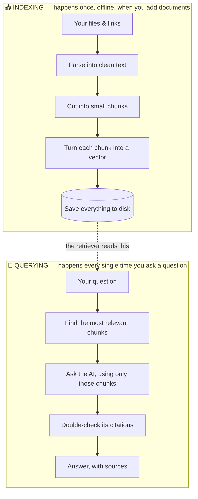
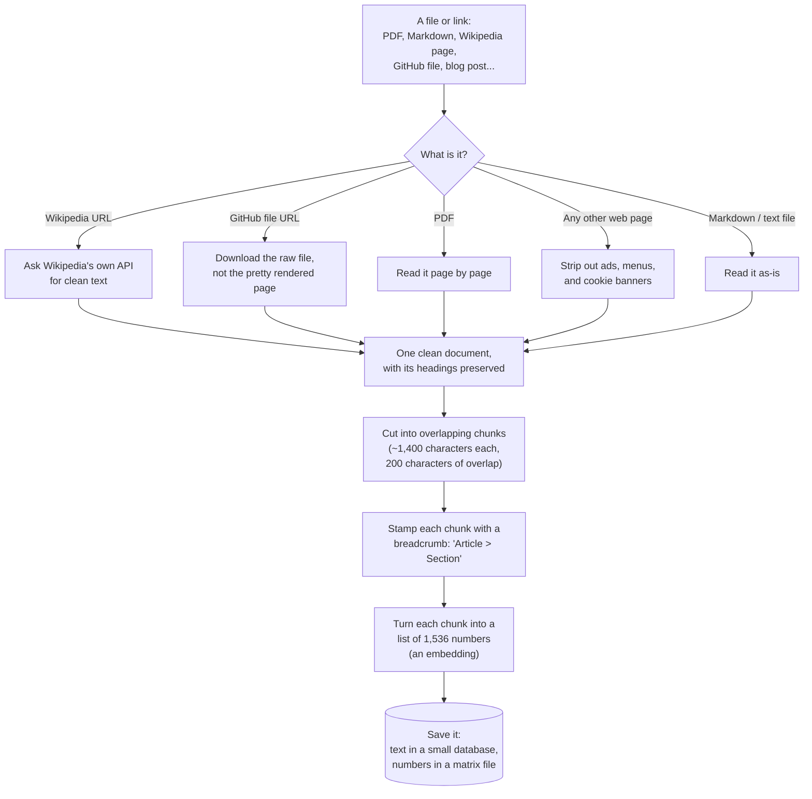
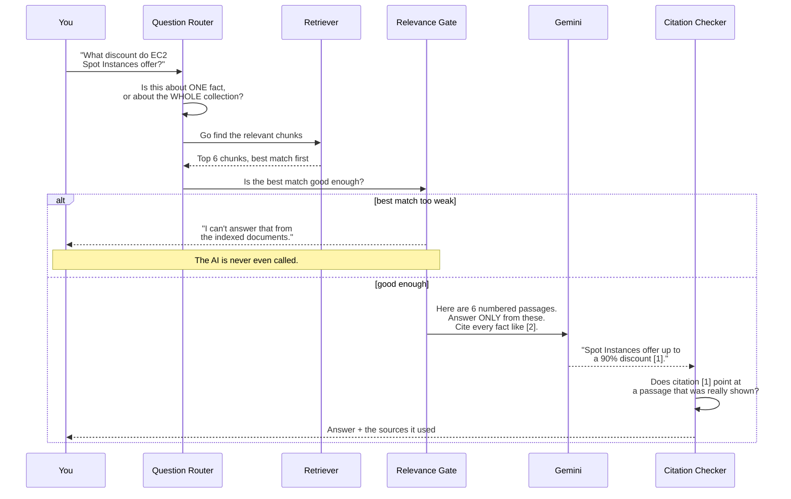
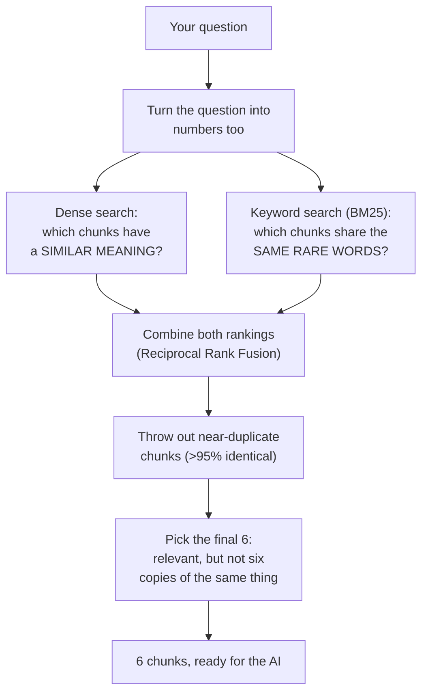
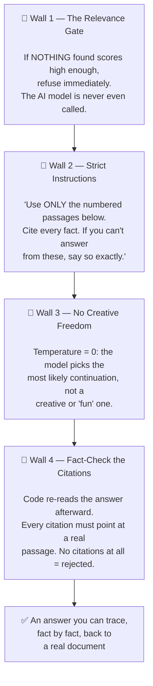
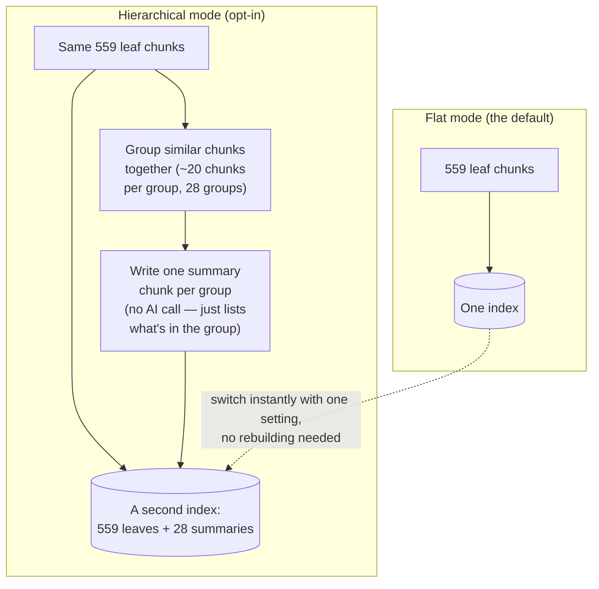
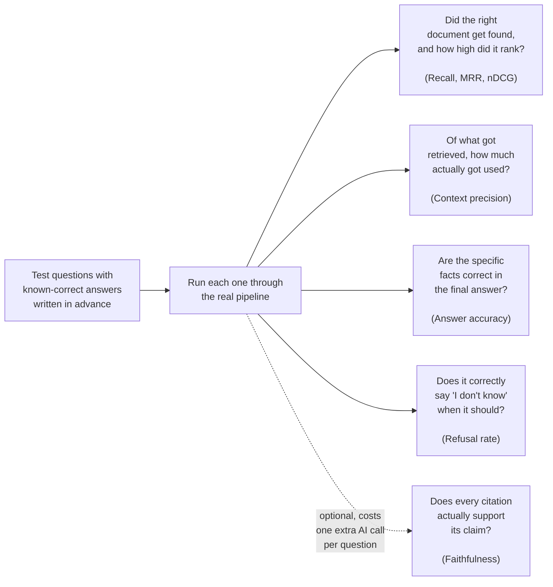
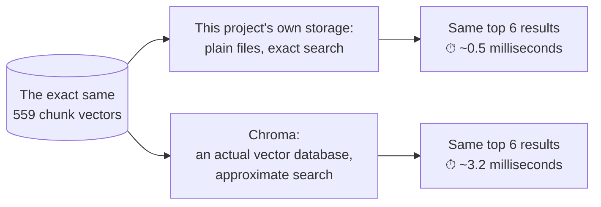

# How this RAG pipeline works, in pictures

This is a companion to [`RAG_GUIDE.md`](RAG_GUIDE.md), which explains the
*concepts*. This one is different on purpose: it's diagrams first, plain
words second, and it follows this exact codebase step by step — no
hypothetical pipeline, no "a typical RAG system." Every box below is a real
function you can open and read.

If you're demoing this to someone, the last section is a cheat sheet of every
command mentioned, grouped so you can run them in order.

**Contents**
1. [The big picture](#1-the-big-picture)
2. [Stage 1 — Getting documents in (indexing)](#2-stage-1--getting-documents-in-indexing)
3. [Stage 2 — Answering a question (the main event)](#3-stage-2--answering-a-question-the-main-event)
4. [Zooming into retrieval](#4-zooming-into-retrieval)
5. [The four walls that stop it from making things up](#5-the-four-walls-that-stop-it-from-making-things-up)
6. [Bonus mode — hierarchical chunking](#6-bonus-mode--hierarchical-chunking)
7. [Checking the work — evaluation](#7-checking-the-work--evaluation)
8. [Bonus comparison — a real vector database](#8-bonus-comparison--a-real-vector-database)
9. [Demo cheat sheet](#9-demo-cheat-sheet)

---

## 1. The big picture

Every RAG system, however fancy, is really just two separate jobs that run
at completely different times. This project keeps that split visible instead
of hiding it:



**In plain words:** Indexing is like building a library's card catalogue —
slow, done rarely, done carefully. Querying is like a librarian using that
catalogue to answer your question in seconds. If the catalogue is wrong,
nothing the librarian does afterward can fix it — which is exactly why
`retrieval recall` (did the right document even get found?) is the first
thing this project measures.

`rag/pipeline.py` has exactly two functions: `ingest()` is the top row,
`Rag.ask()` is the bottom row. Everything else in this repo is a detail of
one of those two.

---

## 2. Stage 1 — Getting documents in (indexing)



**In plain words, stage by stage:**

- **"What is it?"** — Not every source deserves the same treatment. Scraping
  a rendered GitHub page instead of downloading the actual file loses every
  heading in the file — measured on this project: **12,469 characters and
  zero headings**, versus **17,009 characters and 17 headings** from the raw
  file. Headings matter later, so this step matters a lot. *(Code:
  `rag/loaders.py`)*

- **Cutting into chunks** — An AI model can't usefully "read" one giant
  50-page document at once, so it gets cut into bite-sized pieces. Cut them
  wrong and you get two problems: pieces too big (vague, wastes space) or
  pieces too small (a sentence like "It costs 90% less" with no idea what
  "it" is). This project cuts along natural section breaks, not just a fixed
  character count, so a piece never straddles two different topics.
  *(Code: `rag/chunk.py`)*

- **The breadcrumb trick** — Before a chunk gets turned into numbers, its
  title and section get glued on the front: *"Amazon EC2 > Overview\n\nEC2
  lets you run..."*. Without this, a chunk that just says "It reduces costs
  by 90%" is nearly unfindable, because nothing in it says what "it" is.

- **Turning text into numbers (embedding)** — This is the part that makes
  search "understand" meaning instead of just matching exact words. Two
  sentences that mean the same thing end up as two lists of numbers that
  point in almost the same direction — even if they don't share a single
  word. Think of it as a fingerprint for *meaning* rather than for *spelling*.
  *(Code: `rag/embed.py`, using Google's `gemini-embedding-2` model)*

- **Saving it** — No fancy database here on purpose. The chunk **text**
  lives in a small SQLite file, and the **numbers** live in one big matrix
  file (`vectors.npy`). At this size (559 chunks), a plain search through
  that matrix takes **under one millisecond** — see [section 8](#8-bonus-comparison--a-real-vector-database)
  for the proof. *(Code: `rag/store.py`)*

- **One more thing worth knowing:** re-running this whole process a second
  time, after you've already indexed everything, costs **zero** API calls
  and takes about a second — because every chunk's numbers are cached by
  their exact content. Add one new document, and only *that* document gets
  turned into numbers; nothing else is touched.

---

## 3. Stage 2 — Answering a question (the main event)



**In plain words:** Notice that the AI model only gets involved in the
*second half* of this. If nothing relevant was found, the system refuses
**before spending a single API call on the model** — which also means it
never gets the chance to "helpfully" make something up from its own general
knowledge instead of your documents.

The citation checker at the end is doing something most RAG demos skip
entirely: after the AI writes its answer, code — not the AI — goes back and
checks that every `[1]`, `[2]`, etc. actually points at one of the 6 passages
that were really shown to it. An answer with **no citations at all** gets
thrown out and replaced with a refusal, because an unverifiable claim is
treated the same as a wrong one. *(Code: `rag/generate.py`)*

---

## 4. Zooming into retrieval

"Find the relevant chunks" from the diagram above is doing more than it
looks like. Here's what's actually inside that one box:



**Why two kinds of search instead of one?**

Meaning-based search (dense) is great at understanding that *"how much
cheaper"* and *"discount"* mean roughly the same thing. It's weak on rare,
specific tokens — a product code, a gene name, an acronym like `MPZ`.
Keyword search (BM25 — the same family of algorithm search engines have used
for decades) is the opposite: no understanding of meaning, but it never
misses an exact match. Running both and combining the results catches
whatever either one alone would miss.

**Why combine them by *rank* instead of by *score*?**

A "meaning similarity" score and a "keyword match" score aren't measured on
the same scale — one might range 0.5–0.9, the other could be any positive
number. Comparing them directly would be like comparing a temperature in
Celsius to one in Fahrenheit without converting. Instead, each search just
says "this chunk is my #1 pick, this one's my #2..." and the two *rankings*
get merged. No conversion needed. *(This trick is called Reciprocal Rank
Fusion — `RRF_K = 60` in this project.)*

**Why remove near-duplicates, and why does the final pick step exist
separately?**

Measured on this exact project's data: the chunks for "Amazon EC2" and
"Amazon EC2 Image Builder" turned out to be **95.7% identical** — same
category, same launch date, same boilerplate summary. Without a check, both
could occupy two of your only six slots, showing the AI the same information
twice while a genuinely different, useful chunk gets left out. The final
step (called MMR) then picks the last few chunks by balancing "is this
relevant" against "is this too similar to what I already picked" — so the
six chunks the AI sees cover six *different* things, not one thing six times.

*(Code: `rag/retrieve.py`. Try it yourself with `uv run inspect "your
question"` — it prints exactly what came back, with every score, and no AI
call.)*

---

## 5. The four walls that stop it from making things up

"Only answer from the documents" isn't one setting you flip on. It's four
separate, independent checks — and that's deliberate, because if only one
existed and it failed, nothing else would catch the mistake.



**Why four walls and not just a good prompt?** Because a prompt is a
*request*, not a *guarantee* — the model can ignore it. Wall 4 is the one
that catches that: it doesn't ask nicely, it mechanically checks. The proof
this matters: on this project's own test questions, some questions were
about topics that genuinely exist in the documents (so Wall 1 lets them
through) but ask for a specific detail the documents never state (so only
Walls 2–4 can catch it). Every single one was still caught correctly.

There's a known, honest gap even with all four walls: citation-checking
verifies a citation **points at a real passage** — it does not (by itself)
verify that passage **actually supports** the specific sentence citing it.
That's what [faithfulness checking](#7-checking-the-work--evaluation) is
for, and it's optional because it costs an extra AI call per answer to run.

---

## 6. Bonus mode — hierarchical chunking

Everything above describes the default. This project also has a second,
optional mode you can switch to instantly, mainly to *demonstrate* an idea:
what if some chunks summarised *groups* of other chunks?



**In plain words:** Imagine asking *"what database options does AWS
offer?"* A single leaf chunk only ever describes *one* service. But a
summary chunk that says *"this group covers Amazon Aurora, DynamoDB, RDS for
Db2, RDS on VMware, and Lightsail's managed databases"* can answer a broad
question in one shot. Measured on this project: asking that exact question
in hierarchical mode pulled in a summary chunk, and the final answer named
two services that never made the flat mode's top 6 on their own.

The summaries aren't written by an AI — they're built from a template
(cluster the chunks by similarity, list what's in each cluster). That's a
deliberate choice: it's free, instant, and can't fail mid-demo if an API
call times out.

Switching modes is instant because **both indexes are built ahead of time**
and live in separate folders — flipping a setting just points the app at a
different, already-built folder.

---

## 7. Checking the work — evaluation

How do you know any of this actually works, instead of just looking like it
does? By running real test questions with known correct answers through the
whole pipeline and grading the result.



**The one number worth understanding, not just reading:** *"MRR = 1.000"*
sounds abstract. In plain terms, it means: across every test question with a
known correct document, that document was found and put in **first place**
— not just "somewhere in the top 6," but always first. That's a stronger,
more specific claim than a plain "yes/no, was it found" score.

**Why faithfulness checking is separate and optional:** it means asking the
AI a *second* question — "does this citation actually support this
sentence?" — for every single answer, which doubles the cost of running the
test. It's proven to actually catch problems, not just rubber-stamp
everything: fed a real answer, it scored **100/100**; fed a deliberately
fabricated one (a wrong percentage, an invented restriction that was never
in the documents), it scored **0/100** and named exactly which claims were
false.

*(This project deliberately did not adopt existing evaluation frameworks
like RAGAS or DeepEval for this — both were actually installed and tested;
RAGAS fails to even start up on a clean install, and DeepEval works but pulls
in 70 extra packages, defaults to a different AI provider, and sends
analytics data by default. The two metrics that mattered were about 120 lines
to build directly using the same AI connection this project already has.)*

---

## 8. Bonus comparison — a real vector database

This project's storage is deliberately simple: a small database for text, and
one plain numbers-file for the chunk vectors — no dedicated vector database.
The claim is that at this size, that's not a compromise, it's actually
*better*. Here's that claim, made checkable instead of just asserted:



**In plain words:** A real vector database like Chroma is built to search
*millions* of items quickly by not checking every single one — it takes
educated shortcuts (this is what "approximate" means). At 559 items, there's
nothing to be clever about: just checking all 559 directly is not only
simpler, it's faster too, because there's no shortcut-taking machinery to pay
for. The database isn't doing anything wrong here — it's just solving a
problem this project doesn't have yet.

---

## 9. Demo cheat sheet

Every command mentioned above, grouped by what you're showing off. Run these
from the project root; `uv run` handles the Python environment for you.

### Get set up (once)

```bash
cp .env.example .env       # then add your Gemini API key
uv run add ./some-file.pdf https://en.wikipedia.org/wiki/Some_Topic
uv run ingest               # build the default (flat) index
```

### Show the everyday flow

```bash
uv run dev                              # interactive question loop
uv run ask "your question" --chunks     # one answer, PLUS every chunk it saw,
                                         # marked CITED or unused
uv run inspect "your question"          # what retrieval alone found —
                                         # no AI call, just the raw ranking
```

### Show the four walls actually working

```bash
uv run ask "something totally unrelated to your documents"
# -> refused by Wall 1, before the AI is ever called

uv run ask "a question about a real topic, but a detail your docs never state"
# -> refused by Walls 2-4, even though the topic is genuinely in your documents
```

### Show hierarchical mode, switching instantly

```bash
RAG_CHUNK_MODE=hierarchical uv run ingest   # build the second index (once)
RAG_CHUNK_MODE=hierarchical uv run dev      # switch — instant, no rebuild
RAG_CHUNK_MODE=hierarchical uv run ask "a broad question spanning several related things" --chunks
# look for a "Cluster summary (N related items)" source in the output
```

### Show the evaluation numbers

```bash
uv run eval                    # recall, MRR, nDCG, context precision,
                                # answer accuracy, refusal rate
uv run eval --faithfulness     # adds the citation-honesty check
                                # (costs one extra AI call per question)
uv run eval --fresh            # ignore cached answers, re-ask everything
```

### Show storage isn't a weak point

```bash
uv sync --extra chroma                    # install the comparison tool (once)
uv run compare-store "your question"      # same vectors, two storage engines,
                                           # side by side, with timing
```

### See what's actually stored, with your own eyes

```bash
uv run list                    # every document: id, type, size, source
uv run status                  # is everything in sync? how big is it?
```
